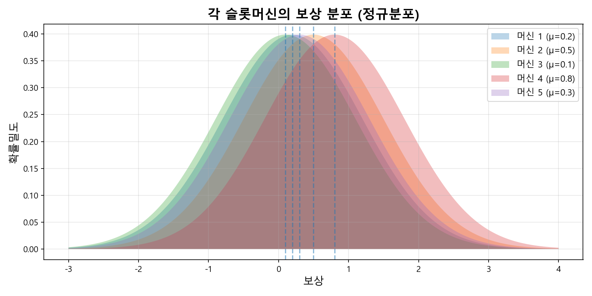
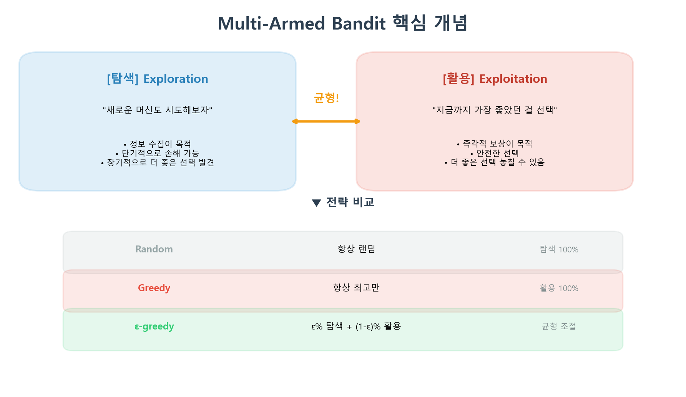
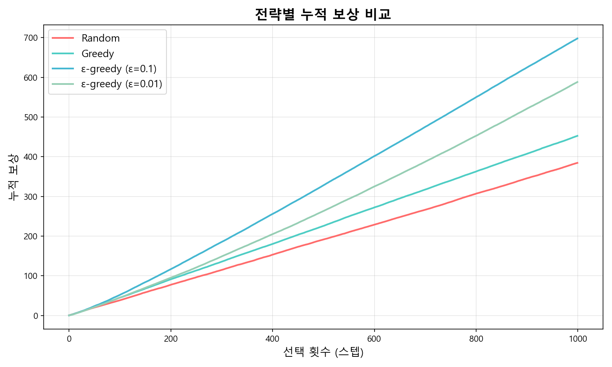
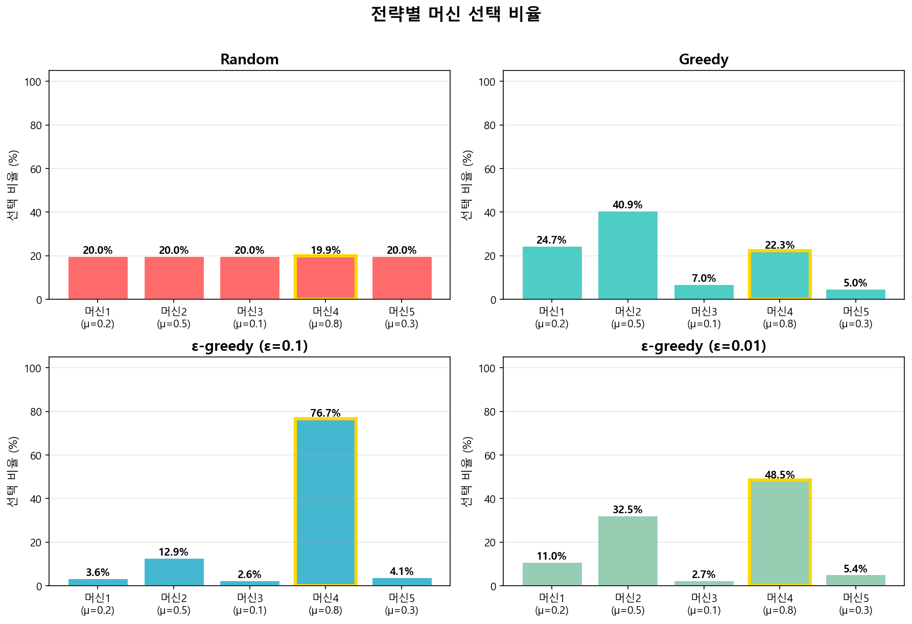
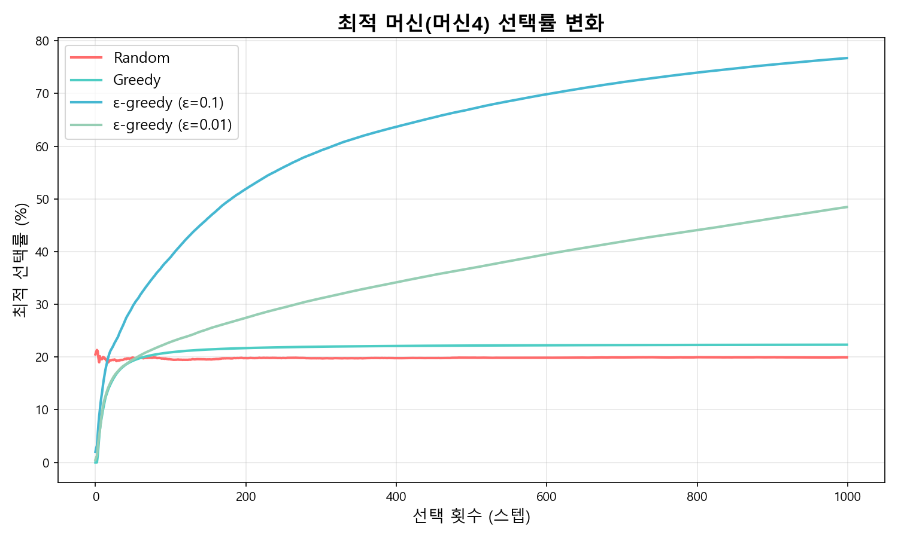
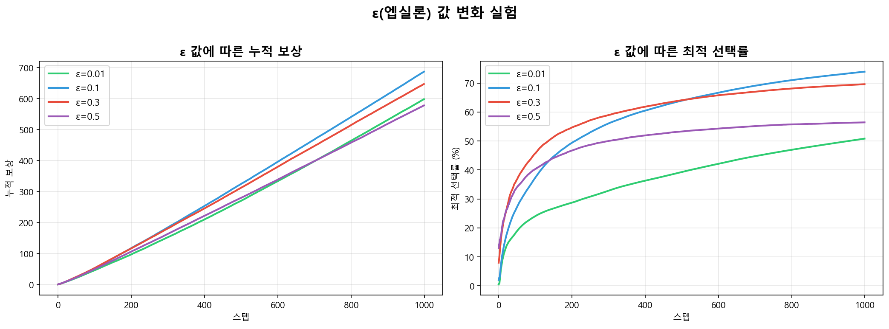

# Multi-Armed Bandit (다중 슬롯머신 문제) 완벽 가이드

## 1. 이게 뭔데? — 한 줄 요약

> **"5개 슬롯머신 중 어떤 게 제일 돈을 잘 주는지 모르는 상태에서, 직접 당겨보면서 최고의 머신을 찾아라!"**

이것이 바로 **강화학습(Reinforcement Learning)** 의 가장 기본이 되는 문제입니다.

---

## 2. 왜 이게 중요한가?

Multi-Armed Bandit은 단순한 슬롯머신 문제처럼 보이지만, 실제로 **엄청나게 많은 곳에서** 쓰입니다:

| 실제 사례                | Bandit 관점                          |
| ------------------------ | ------------------------------------ |
| 유튜브 썸네일 A/B 테스트 | 어떤 썸네일이 클릭률이 높은지 탐색   |
| 온라인 광고 배치         | 어떤 광고가 수익이 높은지 학습       |
| 신약 임상시험            | 어떤 약이 효과가 좋은지 탐색         |
| 추천 시스템              | 어떤 콘텐츠가 사용자에게 맞는지 탐색 |

핵심은 항상 같습니다: **모르는 상태에서 시도하면서 배운다.**

---

## 3. 환경 설계 — 슬롯머신 5개

각 슬롯머신은 고유한 **평균 보상(μ)** 을 가지고 있지만, **우리는 이걸 모릅니다.** 직접 당겨봐야 알 수 있죠.

| 머신  | 진짜 평균(μ) | 비고             |
| ----- | ------------ | ---------------- |
| 머신1 | 0.2          |                  |
| 머신2 | 0.5          |                  |
| 머신3 | 0.1          | 최악             |
| 머신4 | **0.8**      | **정답 (최고!)** |
| 머신5 | 0.3          |                  |

보상은 **정규분포(N(μ, 1))** 를 따르므로, 같은 머신을 당겨도 매번 다른 결과가 나옵니다.

### N(μ, 1) 이 뭔데?

**N** = Normal Distribution (정규분포)의 약자이고, 괄호 안의 두 숫자는:

- **첫 번째 = μ (뮤)** → **평균** (분포의 중심)
- **두 번째 = 1** → **표준편차** (분포의 폭, 결과가 얼마나 흔들리는지)

예: 머신4는 **N(0.8, 1)** → 평균 0.8을 중심으로 ±1 정도 흔들리는 보상을 줌

### 왜 정규분포를 쓰나?

만약 보상이 **고정값**이라면 (머신4가 항상 0.8을 준다면):

- 5개 머신을 한 번씩만 당기면 바로 정답을 알 수 있음
- 탐색(Exploration)이 필요 없어서 문제가 너무 쉬움

정규분포로 **보상이 매번 흔들리기 때문에:**

```
머신4를 5번 당긴 결과 예시:
  1번째: 1.3
  2번째: -0.1   ← 운 나쁘면 마이너스도 나옴!
  3번째: 0.9
  4번째: 1.5
  5번째: 0.2
```

- 한두 번 당겨서는 이 머신이 좋은지 나쁜지 **확신할 수 없음**
- **여러 번 당겨봐야** 평균이 0.8 근처라는 걸 알 수 있음
- 그래서 **탐색과 활용의 딜레마**가 생기는 것!

> 한마디로: **정규분포 = "보상에 노이즈(잡음)가 있다"** → 이 때문에 문제가 어렵고, 전략이 필요합니다.

### 에이전트는 μ를 모른다!

머신4의 μ=0.8이 제일 높으니 "평균적으로" 보상이 가장 크지만, **에이전트는 이 사실을 모릅니다:**

|                   | 신(God) 시점      | 에이전트 시점       |
| ----------------- | ----------------- | ------------------- |
| 머신4의 평균      | μ=0.8 (최고!)     | **???**             |
| 어떤 머신이 최고? | 머신4             | **모름!**           |
| 보상 결과         | 정규분포에서 나옴 | 당겨봐야 알 수 있음 |



> 머신4(μ=0.8)의 분포가 가장 오른쪽에 있어서 평균적으로 가장 높은 보상을 줍니다. 하지만 분포가 겹치기 때문에 **한 번 당겨서는 어떤 게 최고인지 알 수 없습니다!**

---

## 4. 핵심 개념 — Exploration vs Exploitation

이 과제의 **가장 중요한 개념**입니다.



### 쉬운 비유

> 매일 점심을 먹으러 갈 때:
>
> - **Exploitation**: 항상 맛있었던 단골집만 간다 → 안전하지만, 더 맛있는 신상 맛집을 놓칠 수 있음
> - **Exploration**: 새로운 식당도 가본다 → 맛없을 수도 있지만, 대박 맛집을 발견할 수도 있음
> - **ε-greedy**: 90%는 단골집, 10%는 새 식당 → **균형 잡힌 전략!**

---

## 5. 3가지 전략 구현

### (1) Random 전략

```
매 턴마다 5개 머신 중 랜덤으로 하나 선택
```

- 탐색 100%, 활용 0%
- 학습을 전혀 하지 않음
- **기준선(baseline)** 역할

### (2) Greedy 전략

```
항상 현재까지 추정 평균이 가장 높은 머신만 선택
```

- 탐색 0%, 활용 100%
- 처음 몇 번의 결과에 **속아버릴 수 있음**

**Greedy의 치명적 문제 — 첫 머신에 갇힘:**

```
턴1: Q = [0, 0, 0, 0, 0] → argmax → 0번 (같으면 첫번째 선택)
     머신1 당김 → 보상 0.6 → Q = [0.6, 0, 0, 0, 0]
턴2: Q = [0.6, 0, 0, 0, 0] → 머신1이 제일 높음 → 또 머신1!
턴3: 또 머신1!
...
→ 다른 머신을 시도해볼 기회가 없음!
```

> `argmax`는 Q 배열 전체를 보고 **가장 큰 값의 위치를 바로 반환**합니다. 순서대로 도는 게 아님!

### (3) ε-greedy 전략

```
확률 ε → 랜덤 선택 (탐색)
확률 1-ε → 최고 추정 머신 선택 (활용)
```

- **가장 널리 쓰이는 전략**
- ε=0.1이면: 매 턴마다 10% 확률로 랜덤, 90% 확률로 Greedy

**ε-greedy 동작 예시 (ε=0.1):**

```python
def select_arm(self):
    if np.random.random() < 0.1:      # 10% 확률
        return np.random.randint(5)    # 랜덤 선택 (탐색)
    else:                              # 90% 확률
        return np.argmax(self.values)  # Q 최고인 걸 선택 (활용)
```

```
턴1: 주사위 0.73 → 0.1보다 큼 → Greedy → Q=[0,0,0,0,0] → 머신1
     머신1 당김 → 보상 0.6 → Q = [0.6, 0, 0, 0, 0]

턴2: 주사위 0.05 → 0.1보다 작음 → 랜덤! → 머신4에 걸림
     머신4 당김 → 보상 1.3 → Q = [0.6, 0, 0, 1.3, 0]

턴3: 주사위 0.82 → Greedy → Q 전체에서 제일 큰 값 찾기
     Q = [0.6, 0, 0, 1.3, 0] → 1.3이 최대 → 머신4 선택!
```

> 1000번 실행하면 **약 100번은 랜덤(탐색), 900번은 Greedy(활용)** 가 되어 모든 머신을 골고루 경험하면서도 최고의 머신을 집중 선택합니다.

### 추정값 업데이트 공식 (Incremental Mean)

```
Q(a) ← Q(a) + 1/n × (r - Q(a))
```

이 공식은 **3가지 전략 모두 동일하게 사용**합니다. 전략마다 다른 것은 "선택 방법"이고, "학습 방법"은 같습니다.

| 기호         | 의미                           | 비유                          |
| ------------ | ------------------------------ | ----------------------------- |
| **Q(a)**     | 머신 a의 현재 추정 평균        | "내가 생각하는 이 식당 평점"  |
| **r**        | 이번에 **환경이 준** 실제 보상 | "오늘 먹어본 결과"            |
| **n**        | 이 머신을 당긴 횟수            | "이 식당 몇 번 가봤는지"      |
| **r - Q(a)** | 오차 (예상과 실제의 차이)      | "생각보다 맛있었나, 별로였나" |

> **r은 에이전트가 정하는 게 아니라, 환경(슬롯머신)이 정규분포에서 뽑아서 주는 값입니다!**

```
에이전트 → "머신4를 당길게!" → 환경
에이전트 ← r = 1.3 (보상 지급) ← 환경
에이전트 → Q를 업데이트
```

**예시로 따라가기:**

```
[1번째] n=1, r=1.3
  Q = 0 + 1/1 × (1.3 - 0) = 1.3
  → "첫 결과니까 그대로 평균 = 1.3"

[2번째] n=2, r=0.5
  Q = 1.3 + 1/2 × (0.5 - 1.3) = 1.3 + (-0.4) = 0.9
  → "이전 보상 1.3과 이번 보상 0.5의 평균 = 0.9"
     실제 확인: (1.3 + 0.5) / 2 = 0.9 ✓

[3번째] n=3, r=0.9
  Q = 0.9 + 1/3 × (0.9 - 0.9) = 0.9
  → "예상과 딱 같았으니 변화 없음"
```

> **Q는 보상 그 자체가 아니라, 지금까지 받은 보상들의 "평균"** 입니다!

**(r - Q(a))** 부분이 핵심:

```
r > Q  →  양수  →  "예상보다 좋았다" → 평균을 올림 ↑
r < Q  →  음수  →  "예상보다 별로다" → 평균을 내림 ↓
r = Q  →  0     →  "딱 예상대로"    → 변화 없음  →
```

**1/n** 은 보정 크기 — n이 클수록(많이 당길수록) 새 결과에 덜 반응합니다.

### 평균을 업데이트하는 이유

Q를 업데이트하지 않으면 에이전트는 **"어떤 머신이 좋은지" 판단할 수가 없습니다.**
매 턴 구조를 정리하면:

```
1단계: 선택  ← 여기서 전략(Random/Greedy/ε-greedy)이 다름
2단계: 보상 받기  ← 환경이 r을 줌
3단계: Q 업데이트  ← 세 전략 모두 같은 공식 (경험을 기억하는 방법)
```

---

## 6. 실험 결과 분석

### 6-1. 누적 보상 비교



| 전략               | 1000스텝 누적 보상 | 해석               |
| ------------------ | :----------------: | ------------------ |
| Random             |        ~384        | 아무것도 안 배움   |
| Greedy             |        ~453        | 잘못된 머신에 갇힘 |
| **ε-greedy (0.1)** |      **~698**      | **최고 성능!**     |
| ε-greedy (0.01)    |        ~588        | 탐색 부족          |

> **ε-greedy(0.1)** 이 압도적으로 좋습니다! 적절한 탐색이 얼마나 중요한지 보여줍니다.

### 6-2. 머신별 선택 비율



> - **Random**: 5개를 균등하게 ~20%씩 선택 (학습 안 함)
> - **Greedy**: 머신4(정답)가 아닌 다른 머신에 많이 갇힘
> - **ε-greedy(0.1)**: 머신4를 ~77% 선택 — 정답을 잘 찾음!
> - **ε-greedy(0.01)**: 머신4를 ~48% 선택 — 탐색이 부족해서 아직 확신이 부족

### 6-3. 최적 머신 선택률



> 시간이 지남에 따라 ε-greedy(0.1)이 **90%에 가까운 확률로** 최적 머신을 선택하게 됩니다.

---

## 7. ε(엡실론) 값 변화 실험



| ε 값    | 탐색 비율 | 특징                                         |
| ------- | --------- | -------------------------------------------- |
| 0.01    | 1%        | 탐색이 너무 적어 최적 머신을 못 찾을 수 있음 |
| **0.1** | **10%**   | **균형 잡힌 최적의 선택**                    |
| 0.3     | 30%       | 탐색이 많아 보상 손실 발생                   |
| 0.5     | 50%       | 거의 랜덤에 가까워짐                         |

---

## 8. 질문에 대한 답변

### Q1. Greedy 전략은 왜 실패할 수 있나?

> **"처음에 운이 나빠서 잘못된 결론을 내리면, 영원히 거기서 못 빠져나옴"**

예를 들어:

1. 머신2를 처음 당겼는데 운 좋게 보상 1.5를 받음
2. 머신4(진짜 최고)를 당겼는데 운 나쁘게 보상 -0.3을 받음
3. Greedy는 "머신2가 최고다!" 라고 결론 → **이후 머신2만 계속 선택**
4. 머신4를 다시 시도해볼 기회가 **영원히 없음**

이것을 **"국소 최적(Local Optimum)에 빠진다"** 고 합니다.

### Q2. ε가 너무 크면 어떤 문제가 생기나?

> **"최고의 머신을 알아도 자꾸 쓸데없이 다른 머신을 당겨서 돈을 낭비"**

- ε=0.5이면 50%의 확률로 랜덤 선택
- 이미 머신4가 최고인 걸 알아도, 절반의 시간을 나쁜 머신에 낭비
- **탐색 과잉 → 보상 손실**

### Q3. ε가 너무 작으면 어떤 문제가 생기나?

> **"틀린 답에 갇힐 확률은 낮지만, 정답을 찾는 데 너무 오래 걸림"**

- ε=0.01이면 100번에 1번만 탐색
- 초기에 잘못된 머신을 최고라고 판단하면, 수정이 매우 느림
- **Greedy와 비슷한 문제가 느린 속도로 발생**

### Q4. Exploration이 필요한 이유?

> **"탐색 없이는 진짜 정답을 절대 찾을 수 없다"**

- 처음에는 **아무 정보가 없음** — 어떤 머신이 좋은지 모름
- 적절한 탐색이 있어야 모든 머신의 성능을 파악 가능
- 단기적 손해를 감수하더라도 장기적으로 **훨씬 더 높은 누적 보상** 획득
- 이것이 강화학습의 핵심: **"지금 당장의 보상 vs 미래의 더 큰 보상"**

---

## 9. 코드 구조

전체 코드는 `multi_armed_bandit.py`에 있습니다. 핵심 구조:

```
SlotMachine         → 개별 머신 (정규분포 보상)
MultiArmedBandit    → 환경 (머신 5개 관리)
RandomAgent         → Random 전략
GreedyAgent         → Greedy 전략
EpsilonGreedyAgent  → ε-greedy 전략
run_experiment()    → 200회 반복 실험 → 평균 결과
```

---

## 10. 3줄 요약

1. **Multi-Armed Bandit = 모르는 상태에서 최고의 선택을 찾는 문제** (슬롯머신 비유)
2. **핵심 딜레마는 "탐색 vs 활용"** — 둘의 균형이 성능을 결정 (ε-greedy가 대표 해법)
3. **실험 결과: ε=0.1이 최적** — 적절한 탐색이 Greedy보다 1.5배 이상 높은 보상 달성
